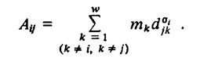
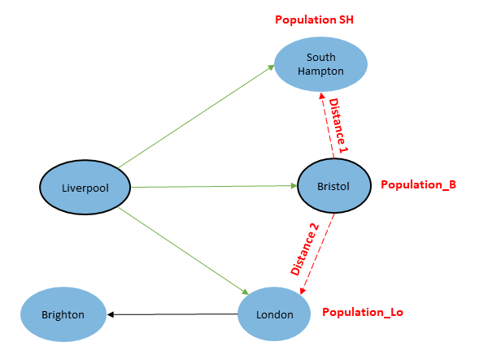
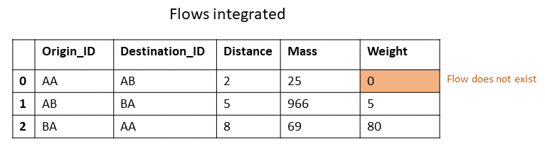

## Introduction

Welcome!

My name is Lenka, I am currently working on my PhD in [Advanced Quantitative Geography at Bristol University ](http://www.bristol.ac.uk/cmm/aqm/), and I got accepted for Google Summer of Code 2021.
For the next three months I will be working alongside [Dr Levi wolf](http://ljwolf.org/) and [Dr Taylor Oshan](https://geog.umd.edu/facultyprofile/oshan/taylor) on implementation of [Competing Destination models](https://journals.sagepub.com/doi/10.1177/0308518X8301500103) for [SpInt python package](https://github.com/pysal/spint).

If you are future GSoC participant and you are interested in seeing my proposal, it is still living on my [google drive](https://docs.google.com/document/d/1VP77-qC2dXMa1_aYVM_R-q7a9DZS5WXHbw0QRN3v2A4/edit?usp=sharing).

If you want to know how is the project going, keep reading. Each entry has title, so you can jump to the most recent entry in the table of contents.

You can find my working repository [here](https://github.com/lenkahas/spint).

## Community Bonding, week 24th May till 1th June

### Meeting the team

On the first meeting, I have been able to connect with my mentors Levi, who is also my PhD supervisor, and Taylor, who is an author of the SpInt package. It has been such a pleasure to connect with Taylor who lives roughly 8.5 thousand kilometres (yes I work in km's and I'm not aiming to change that, so deal with it) away from Bristol where me and Levi are based. We chat about their own experiences with GSoC, as they both have been a participants and now mentors, I was interested in their perspective.  
We have also briefly chat about how the SpInt package is structured, so I get better idea of what will the task entail, and what the first steps are. 

### Meeting the Pysal community and other students with their project.

The pysal community has a meeting once a month, where they discuss current problems, updates and future improvements.
One of the main things discussed on the meeting was the problem of fragmented graph packages and their inability to cater for translation of graphs from other packages such as street network graphs from osmnx. This is very relevant to my work as I have bumped into this issue in March this year. I was trying to speed up the computation of distances along the road for bunch of points and I found that [osmnx](https://github.com/gboeing/osmnx) has the best function for loading street network based on bounding boxes, but [pandana](https://github.com/UDST/pandana) has the fastest computation of shortest paths along the graph (the package is build on C++). To combine these two methods, we just need to translate the graph from osmnx graph to pandana graph. Check out [this post](https://lenkahas.com/post/pandana.html#) to see how this is done and how you can calculate shortest paths using pandana.

It's been good to see how the community takes care of the open-source software, as this part is well hidden from an average user.


## First Coding period 1st June till 6th July. WEEK 1

### Project introduction

For the general introduction into the project please read the [proposal](https://docs.google.com/document/d/1VP77-qC2dXMa1_aYVM_R-q7a9DZS5WXHbw0QRN3v2A4/edit), which provides an overview for the problem. 

There is one main deliverable for this project and that is a function that calculate Accessibility term for competing destination models.
This can be broken down into X steps.
1. Create initial accessibility function
2. Create functional test to validate the function and its future versions
3. Research how the function could be speeded up

### What is the accessibility function

According the initial paper from [Fotheringham (1983)](https://risweb.st-andrews.ac.uk/portal/en/researchoutput/a-new-set-of-spatial-interaction-models-the-theory-of-competing-destinations(8c3f7c99-5efc-4774-9d91-17e0482cecfd)/export.html) the accessibility $A_{ij}$ represents the accessibility of destination $j$ to all other destinations available to origin $i$ as perceived by the residents of origin $i$ and is defined as



This can be little confusing, so let's break it down.

Imagine a migration between 5 following English cities, where people from Liverpool migrate to South Hampton, Bristol and London, and people from London migrate to Brighton.
If we want to calculate the accessibility term for the flow Liverpool to Bristol, we consider following; The accessibility of $\text{flow}_{Li,B}$ is the sum of the connections between the destination (Bristol) to all other destinations. This connection or accessibility between Bristol and other destinations can be then calculated as the distance between Bristol and destination times the mass of the destination. 



In other words;

$$  \text{Accessibility for the flow between Liverpool and Bristol} = \sum \text{population SH * distance1, population Lo * distance2} $$

**Important**: We don't necessarily know if this is meant as an accessibility of all possible destinations in a system, or only those that actually exist for given origin.

I could design 2 functions

    1. Accessibility of flow taking all possible destinations in the system 
    2. Accessibility of flow taking only existing destinations

In those two functions, we would assume that the input is just one Data frame: Data Frame of all possible flows in system with distances between them, masses on destinations and the flow volumes between existing flows (0 where no flow exists).
I have refined those into one function only, that can handle both situations.




### Initial accessibility function


```python
# coding=utf-8
# 3. FlowAccessibility = Accessibility of flow taking existing destinations

def AFED(flow_df, row_index, all_destinations=False): # AFAPF
    
    # rename teh columns so we can call them 
    flow_df = flow_df.rename(columns = {flow_df.columns[0]:'origin_ID', 
                                            flow_df.columns[1]:'dest_ID', 
                                            flow_df.columns[2]:'dist', 
                                            flow_df.columns[3]:'weight', 
                                            flow_df.columns[4]:'dest_mass'})
    # define O and D for each row the variables
    D = flow_df['dest_ID'][row_index]
    O = flow_df['origin_ID'][row_index]
    
    
    # get the list of possible destinations 
    if all_destinations:
         all_dest = (flow_df.query('origin_ID == @O')
                ['dest_ID']
                .unique()
               )
    else:
        all_dest = (flow_df.query('origin_ID == @O')
                .query('weight > 0')
                ['dest_ID']
                .unique()
               )

        
    # Create all destination flows 
    x1 = pd.DataFrame({'D': np.array([D]*len(all_dest), dtype=object), 
                       'dests':all_dest}).merge(flow_df, how='left', left_on=['D','dests'], right_on=['origin_ID','dest_ID'])
    
    # merge with the distances and masses 
    
    # Delete the flow to origin
    x1 = x1[~x1.dests.isin(list(O))]    

    # calculate the accessibility
    A = (x1['dist']*x1['dest_mass']).sum()

    return A
```

### Further notes on accessibility function

I have described accessibility function defined by [Fotheringham (1983)](https://risweb.st-andrews.ac.uk/portal/en/researchoutput/a-new-set-of-spatial-interaction-models-the-theory-of-competing-destinations(8c3f7c99-5efc-4774-9d91-17e0482cecfd)/export.html) as very generic function of distances and masses, however, more specific definition with different weighting could be considered for specific situations. For example, some could opt to substitute distance for some more specific measure of separation, such as travel time or journey cost. Similarly, there is many things that could be considered as a mass on the destination. 

> Note: it would be good to discuss the potential of the function to cater for alternative definitions of accessibility


```python

```
